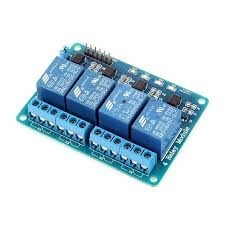
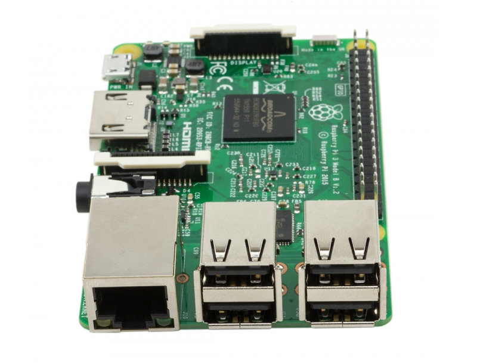

#Control por voz con una Raspberry Pi3

Me compré una **Raspberry Pi 3** y para darle solo un uso tipo sysadmin, había algo más que podría hacer, tantos proyectos realizados con una simple Raspberry Pi y que mis conocimientos no llegan a cubrir todo eso.

Pero decidí hacer una prueba y compré un relé octroacoplado y comencé a jugar con eso. Hasta que surgío, a raíz de algunos videos que vi en Internet, la idea de controlar el encendido por voz de una luz o cualquier otra "cosa" conectada al relé.

Para ello, lo mejor que ví es utilizar **CMU Sphinx** para la decodificación de la voz, es decir, interpretar lo que capta el microfóno y decodificarlo a texto, ***speech to text***. 

El leguaje de programación que más conozco es **Python** por ende la programación está hecha en ese idioma.

Utilicé también los modelos acústicos en español del proyecto **VoxForge**. Los diccionarios los armé yo, siguiendo la guia de la comunidad en inglés y algunos diccionarios en español, pude armar los míos.

La idea es que **CMU Sphinx** esté escuchando continuamente y que, mediante Python, al detectar las palabras "mágicas" ejecute ciertas acciones.

He visto otros proyectos un poco complicado en su programación, este es más sencillo creo yo, y se acerca más a lo que necesitaba.

###Materiales
----
Relé Optoacoplado:
 

Raspberry Pi 3:
  

###Sistema Operativo
----
* Raspbian Jessie

###Depedencia
----

Paquetes necesario para el funcionamiento:

* python-dev
* swig
* bison
* libasound2-dev
* python-dev

Si hay algún error con algunas librerías, es porque no las encuentra. Si ese es el caso, realizar lo siguiente:

	export LD_LIBRARY_PATH=/usr/local/lib

###Compilación CMU Sphinx
----
Para el reconocimiento de voz, necesitamos de compilar primero **sphinxbase-5prealpha** y luego **pocketsphinx-5prealpha**.

Dentro del direcotrio ***sphinxbase-prealpha***:

	./configure --enable-fixed
	make
	sudo make install

Dentro del directorio ***pocketsphinx-prealpha***: 

	./configure
	make
	sudo make install

###Armado del diccionario
----
Para armar el diccionario, debemos crear un archivo de texto que contenga cada palabra que queremos utilizar, por ejemplo, el archivo llamado **diccionario.txt**:

	encender luz
	apagar luz

Y ese archivo lo subimos a la siguiente web: **[LM-TOOLS](www.speech.cs.cmu.edu/tools/lmtool-new.html)**
Generará varios archivos y decargamos el archivo comprimido.

**NOTA**: Tener en cuenta que ese sitio es para armar el diccionario, pero en idioma inglés. Yo lo use de base y después lo modifique mirando los diccionarios en español de **VoxForge** e ir probando.

###Prueba de pocketsphinx
----
Para probar si funciona correctamente, ejecutamos la siguiente instrucciones en un terminal:

	pocketsphinx_continuous -inmic yes -lm 8227.lm -dict 8227.dic > capture.txt -samprate 16000/8000/48000 

Donde **8227.lm** y **8227.dic**, son los diccionarios que generamos en la web LM-TOOLS. Y cada vez que digamos la palabra ***encender luz*** o ***apagar luz*** se irá guardando en un archivo capture.txt.

En el código Python se leerá ese archivo y si contine tal palabra hace tal o cual instrucción.

